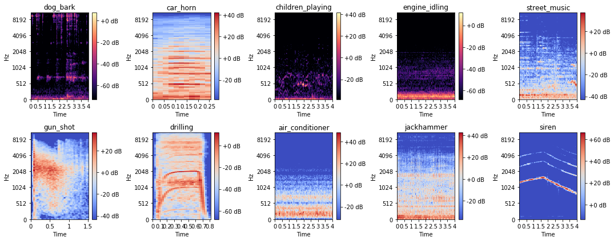

# Audio Classifier and Predictor
 
 ### [URBAN SOUND Audio dataset](https://urbansounddataset.weebly.com/urbansound8k.html)
 Justin Salamon*^, Christopher Jacoby* and Juan Pablo Bello*
* Music and Audio Research Laboratory (MARL), New York University
^ Center for Urban Science and Progress (CUSP), New York University

J. Salamon, C. Jacoby and J. P. Bello, "A Dataset and Taxonomy for Urban Sound Research", 22nd ACM International Conference on Multimedia, Orlando USA, Nov. 2014.

## Dataset used for training Model to predict sounds heard..

